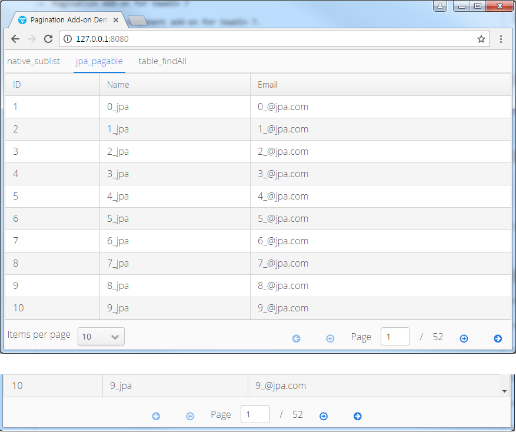

=  Pagination Add-on for Vaadin 7

Pagination is a UI component add-on for Vaadin 7.

[source,java,indent=0]
----
 Page Resources : { currentPage: 1 / 52, limit: 10, offset: 0, pageIndex: 0, fromIndex: 0, toIndex: 10, isFirst: true, hasPrevious: false, hasNext: true, isLast: false, totalCount: 512, initIndex: 0 }
----

== Pagination Maven

[source,xml,indent=0]
----
<dependency>
	<groupId>com.vaadin.addon</groupId>
	<artifactId>pagination</artifactId>
	<version>${project.version}</version>
</dependency>

<repository>
   <id>vaadin-addons</id>
   <url>http://maven.vaadin.com/vaadin-addons</url>
</repository>
----

== Pagination Example Code

=== Java Collection + Pagination

[source,java,indent=0]
----
public static List<User> userList = new ArrayList<>();
//...

final int page = 1;
final int limit = 20;

final List<User> users = userList.subList(0, limit);
final long total = Long.valueOf(userList.size());

final Table table = createTable(users);
final Pagination pagination = createPagination(total, page, limit);
pagination.addPageChangeListener(new PaginationChangeListener() {
    @Override
    public void changed(PaginationResource event) {
        log.debug("nativeSublist: {}", event.toString());
        table.removeAllItems();
        for(User user : userList.subList(event.fromIndex(), event.toIndex())) {
            table.addItem(user);
        }
    }
});

//...
private Table createTable(List<User> users) {
        final Table table = new Table();
        table.setSizeFull();
        table.setContainerDataSource(new BeanItemContainer<>(User.class, users));
        table.setVisibleColumns("id", "name","email");
        table.setColumnHeaders("ID", "Name","Email");
        return table;
    }

private Pagination createPagination(long total, int page, int limit) {
    final PaginationResource paginationResource = PaginationResource.newBuilder().setTotal(total).setPage(page).setLimit(limit).build();
    final Pagination pagination = new Pagination(paginationResource);
    pagination.setItemsPerPage(10, 20, 50, 100);
    return pagination;
}
----

=== Spring Data Jpa + Pagination

[source,java,indent=0]
----
@Autowired
UserRepository userRepository;
//...

final int page = 1;
final int limit = 10;

final Page<User> users = findAll(0, limit);
final long total = users.getTotalElements();

final Table table = createTable(users.getContent());
final Pagination pagination = createPagination(total, page, limit);
pagination.addPageChangeListener(new PaginationChangeListener() {
    @Override
    public void changed(PaginationResource event) {
        log.debug("jpaPagable : {}", event.toString());
        table.removeAllItems();
        Page<User> users = findAll(event.pageIndex(), event.limit());
        for(User user : users) {
            table.addItem(user);
        }
    }
});

//...
public Page<User> findAll(int page, int size) {
    Pageable pageable = new PageRequest(page, size);
    Page<User> users = userRepository.findAll(pageable);
    return users;
}
----

=== Vaadin Table + Pagination

[source,java,indent=0]
----
@Autowired
UserRepository userRepository;
//...

final int page = 1;
final int limit = 10;

final List<User> users = userRepository.findAll();
final long total = users.size();

final Table table = createTable(users.getContent());
table.setWidth(100, Unit.PERCENTAGE);
table.setHeightUndefined();
table.setPageLength(limit);

final Pagination pagination = createPagination(total, page, limit);
pagination.setItemsPerPageVisible(false);
pagination.addPageChangeListener(new PaginationChangeListener() {
    @Override
    public void changed(PaginationResource event) {
        log.debug("tableFindAll : {}", event.toString());
        table.setPageLength(event.limit());
        table.setCurrentPageFirstItemIndex(event.offset());
    }
});
----

## Building and running demo

[source,groovy,indent=0]
----
mvn clean install
mvn -pl pagination-demo spring-boot:run
----

Demo Server : http://127.0.0.1:8080

== Building from source

requires Java SE 1.7.0_79+

requires Maven 3.3.9+

requires Tomcat 8.0.36+

requires Eclipse Mars.2 4.5.2+ (Eclipse IDE for Java EE Developers 설치)

requires Vaadin Framework 7.7.3+

== License & Author

Add-on is distributed under Apache License 2.0. For license terms, see LICENSE.txt.

